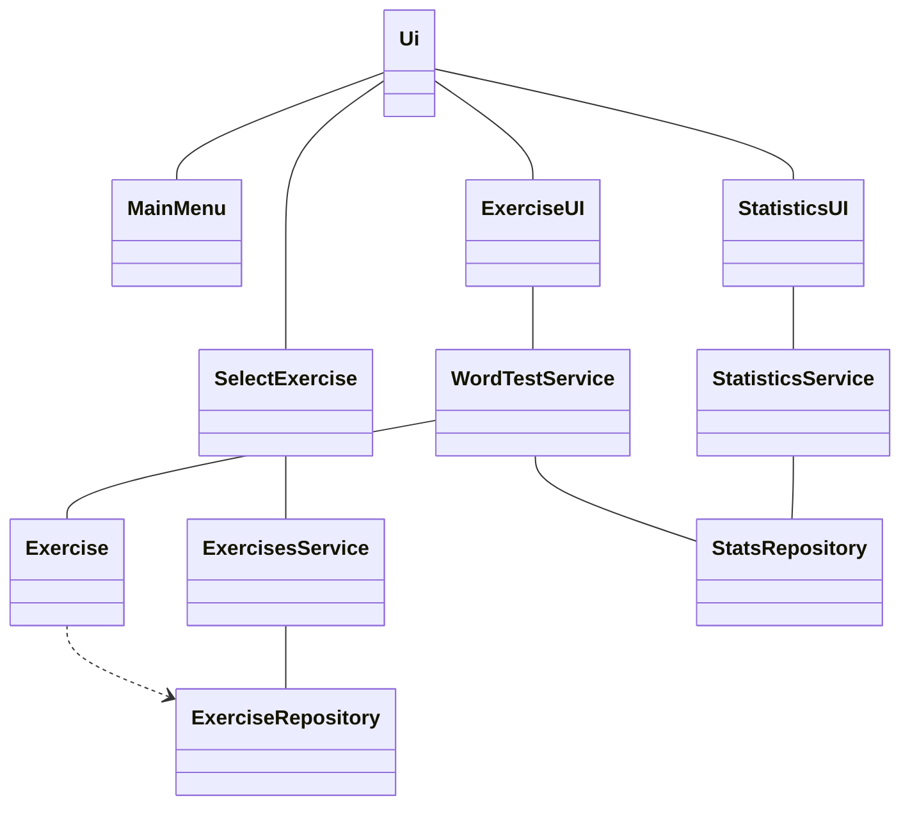
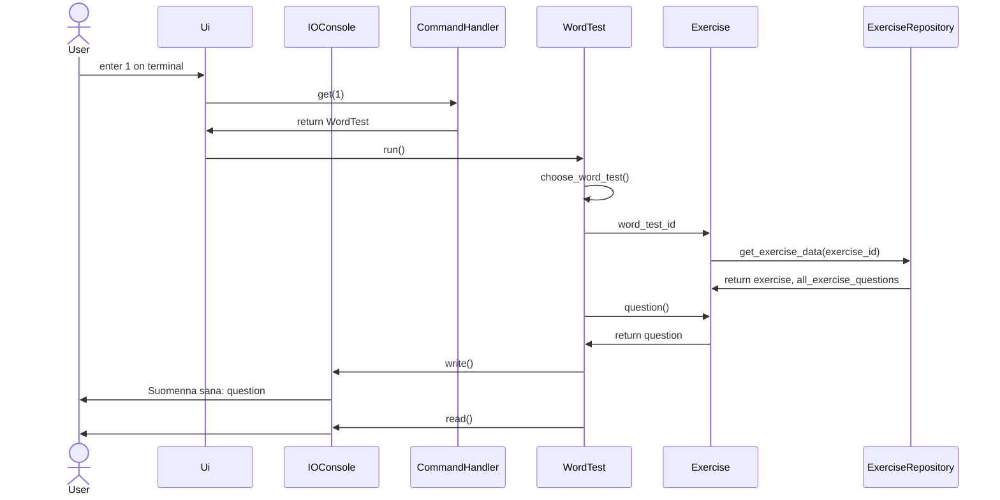

# Ohjelman arkkitehtuuri

## Luokkakaavio

Luokka UI on ylin käyttöliittymästä vastaava luokka ja se avaa näkymät, jotka käyttäjä näkee. MainMenu vastaa päävälikon/etusivun näkymästä. SelectExercise vastaa näkymästä, jossa käyttäjä voi valita harjoitukse. ExerciseUI vastaa kokeen näkymästä ja StatisticsUI vastaa sivusta, jolla näkyy tilastot.

Luokka Exercise sisältää meneillään olevan harjoituksen kysymykset ja vastaukset. Kun siitä luodaan uusi olio, se hakee harjoituksen tiedot ExerciseRepositorystä harjoituksen id-numeron perusteella.
WordTestService sisältää sanakokeiden ohjelmalogiikan. StatisticsService hakee tilastotiedot ja muokkaa ne valmiiksi tulostettavaan muotoon. ExercisesService hakee tietokannasta kaikki harjoitukset listana.

ExerciseRepository hakee harjoituksen tietoja tietokannasta. StatsRepository tallentaa ja hakee tilastoja tietokannasta.

## Sekvenssikaavio

Alla oleva sekvenssikaavio kuvaa tapahtumia, kun käyttäjä haluaa tehdä sanakokeen. Alussa käyttäjä on alkuvalikossa ja kaavio loppuu siihen, kun ohjelma odottaa käyttäjältä vastausta ensimmäiseen kysymykseen. WordTestin metodissa choose_word_test() käyttäjä myös valitsee minkä sanakokeen hän haluaa tehdä vaikka sitä ei kaaviossa käydä läpi.

