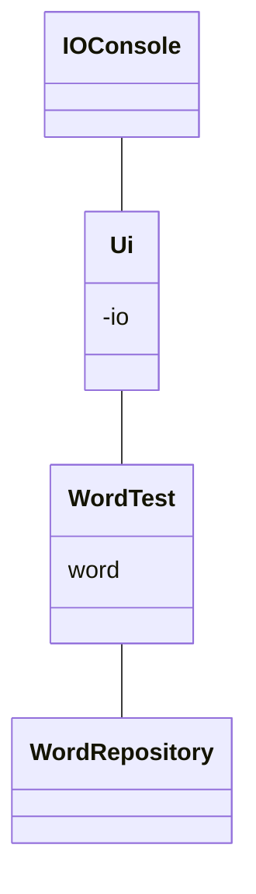

# Ohjelman arkkitehtuuri

## Luokkakaavio

Luokka IOConsole vastaa kommunikoinnista käyttäjän kanssa. Luokassa Ui on käyttöliitymän toiminnot sekä ohjelmasilmukka. WordTest sisältää sanakokeen tarvitsemat metodit. WordRepository hakee sanoja tietokannasta.
