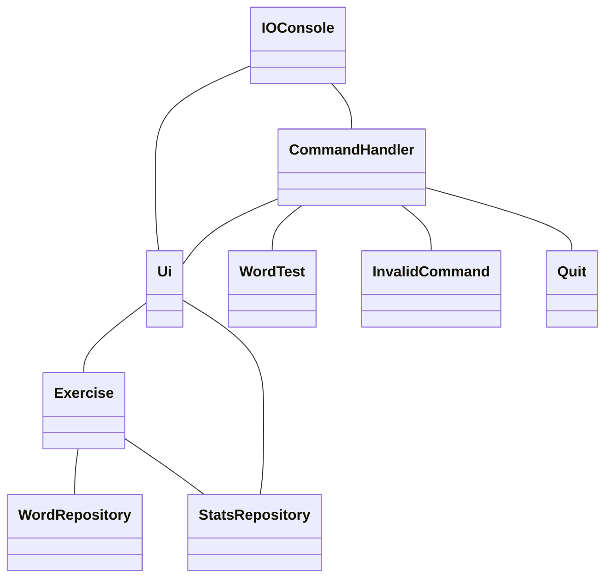
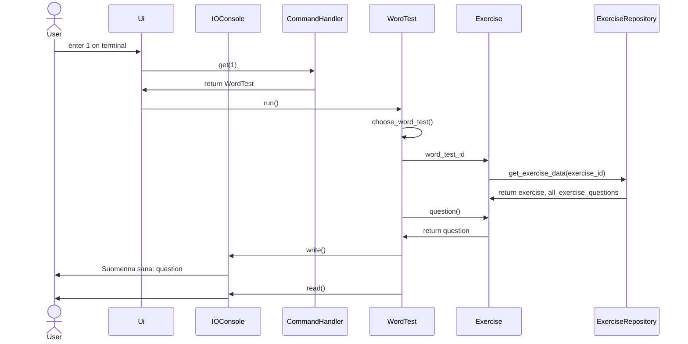

# Ohjelman arkkitehtuuri

## Luokkakaavio

Luokka IOConsole vastaa kommunikoinnista käyttäjän kanssa. Luokassa Ui on käyttöliitymän toiminnot sekä ohjelmasilmukka. WordTest sisältää sanakokeen tarvitsemat metodit. WordRepository hakee sanoja tietokannasta. StatsRepository tallentaa ja hakee tilastoja tietokannasta. WordTest pyytää StatsRepositorya tallentamaan tiedon jokaisesta oikeasta vastauksesta.

## Sekvenssikaavio

Alla oleva sekvenssikaavio kuvaa tapahtumia, kun käyttäjä haluaa tehdä sanakokeen. Alussa käyttäjä on alkuvalikossa ja kaavio loppuu siihen, kun ohjelma odottaa käyttäjältä vastausta ensimmäiseen kysymykseen. WordTestin metodissa choose_word_test() käyttäjä myös valitsee minkä sanakokeen hän haluaa tehdä vaikka sitä ei kaaviossa käydä läpi.

