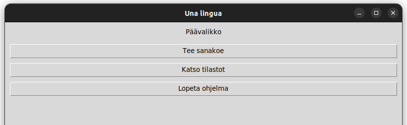
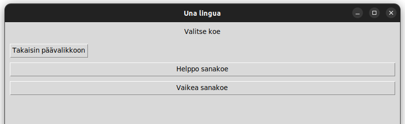
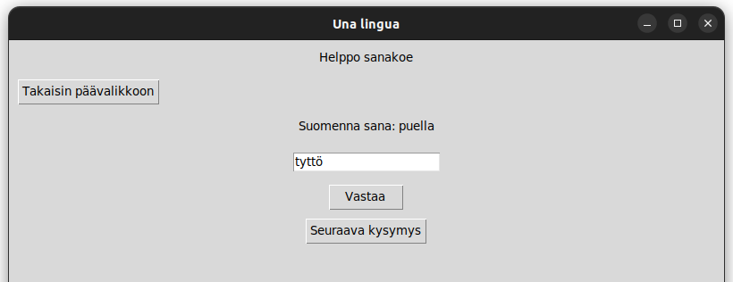

# Käyttöohje

## Asennus

Asenna riippuvuudet komennolla

    poetry install

Asenna tietokanta komennolla

    poetry run invoke init-db

## Käynnistys

Käynnistä ohjelma komennolla 

    poetry run invoke start

Ohjelma aukeaa päävalikkoon.

## Päävalikko

Käynnistettäessä ohjelma avautuu päävalikkoon. Painamalla 'Tee sanakoe' siirtyy valikkoon, jossa voi valita sanakokeen. Painamalla 'Katso tilastot' avautuu sivu, jolla näkyy tilastotiedot. Ohjelman voi lopettaa painamlla 'Lopeta ohjelma'.

## Sanakokeen valitseminen

Sanakokeen voi valita painamalla nappia. Päävalikkoon voi palata painamalla 'Takaisin päävalikkoon'..

## Sanakoe

Sanakokeesta voi poistua milloin tahansa painamalla 'Takaisin päävalikkoon'. Muuten kysymykseen voi antaa vastauksen kirjoittamalla se tekstikenttään ja painamlla 'Vastaa'. Ohjelma kertoo oliko vastaus oikein vai väärin. Jos vastaus oli oikein, käyttäjä ei voi enää vastata samaan kysymykseen uudelleen. Seuraavaan kysymykseen voi aina siirtyä painamalla 'Seuraava kysymys'. Takaisin päin ei voi enää siirtyä. Kun kaikki kysymykset on käyty läpi, koe loppuu. Jos kaikkiin kysymyksiin antoi oikean vastauksen, merkitään tilastoihin, että käyttäjä on suorittanut yhden uuden sanakokeen kokonaisuudessaan.