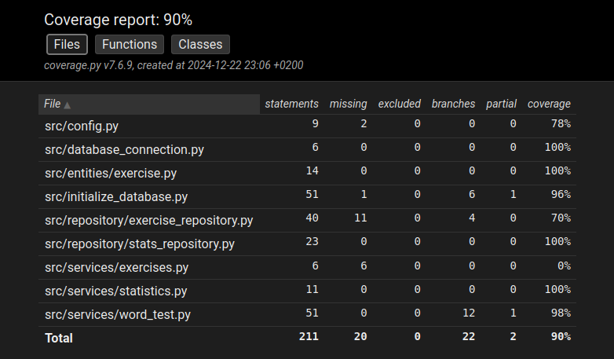

# Testausdokumentti

Ohjelmaa on testattu automatisoidusti Unittestillä. Järjestelmätason testausta on tehty manuaalisesti.

## Yksikkö- ja integraatiotestaus

TestWordTestService-luokka testaa sanakokeiden ohjelmalogiikasta vastaavaa WordTestService-luokkaa. Tietokannan sijaan nämä testit hakevat tietoa StubExerciseRepository- ja StubStatsRepository-luokista, jotka injektoidaan WordTestService-oliolle.

TestStatisticsService-luokka testaa, että metodi printable_statistics palauttaa tilastotiedot halutussa muodossa. Tietokannan sijaan käytetään StubStatsRepository-luokkaa.

TestExerciseRepository-luokka testaa, että ExerciseRepository-luokka paluttaa oikean tyyppisiä asioita tietokannasta.

TestStatsRepository-luokka testaa tilastotietojen tallentamista tietokantaa ja niiden noutamista sieltä. Testeissä annetaan oikeita ja vääriä vastauksia sanakokeeseen ja katsotaan, että tilastotieto tallennetaan asianmukaisesti.

## Testikattavuus

