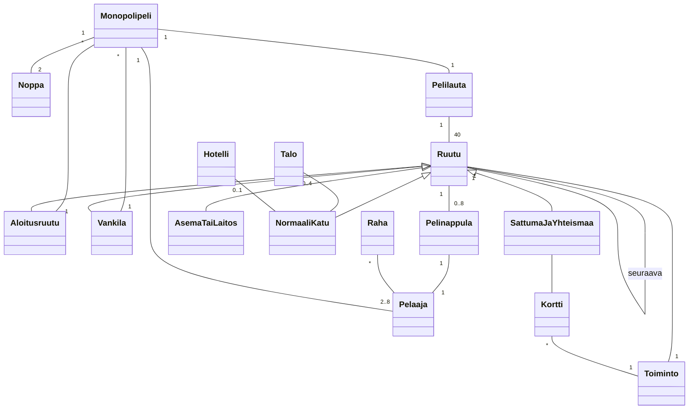

## Monopolin alustava luokkakaavio

```mermaid
classDiagram
    Monopolipeli "1" -- "2" Noppa
    Monopolipeli "1" -- "1" Pelilauta
    Monopolipeli "*" -- "1" Aloitusruutu
    Monopolipeli "*" -- "1" Vankila

    Pelilauta "1" -- "40" Ruutu
    Ruutu "1" -- "1" Ruutu : seuraava
    Ruutu "*" -- "1" Toiminto
    Ruutu <|-- Aloitusruutu
    Ruutu <|-- Vankila
    Ruutu <|-- SattumaJaYhteismaa
    Ruutu <|-- AsemaTaiLaitos
    Ruutu <|-- NormaaliKatu
    
    Ruutu "1" -- "0..8" Pelinappula
    Pelinappula "1" -- "1" Pelaaja
    Pelaaja "2..8" -- "1" Monopolipeli

    Kortti "*" -- "1" Toiminto
    SattumaJaYhteismaa -- Kortti
    Raha "*" -- Pelaaja
    Talo "0..4" -- NormaaliKatu
    Hotelli "0..1" -- NormaaliKatu
```
