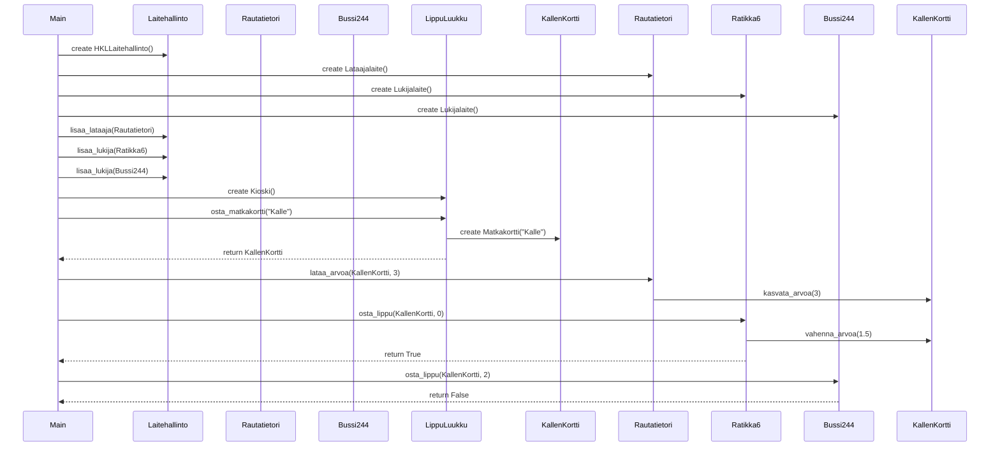

# main-funktion suoritus



```
sequenceDiagram
    participant Main
    participant HKLLaitehallinto as Laitehallinto
    participant Lataajalaite as Rautatietori
    participant Lukijalaite as Ratikka6
    participant Lukijalaite as Bussi244
    participant Kioski as LippuLuukku
    participant Matkakortti as KallenKortti


    Main ->> HKLLaitehallinto: create HKLLaitehallinto()

    Main ->> Rautatietori: create Lataajalaite()
    Main ->> Ratikka6: create Lukijalaite()
    Main ->> Bussi244: create Lukijalaite()

    Main ->> HKLLaitehallinto: lisaa_lataaja(Rautatietori)
    Main ->> HKLLaitehallinto: lisaa_lukija(Ratikka6)
    Main ->> HKLLaitehallinto: lisaa_lukija(Bussi244)

    Main ->> Kioski: create Kioski()
    Main ->> Kioski: osta_matkakortti("Kalle")
    Kioski ->> Matkakortti: create Matkakortti("Kalle")
    Kioski -->> Main: return KallenKortti

    Main ->> Rautatietori: lataa_arvoa(KallenKortti, 3)
    Rautatietori ->> KallenKortti: kasvata_arvoa(3)

    Main ->> Ratikka6: osta_lippu(KallenKortti, 0)
    Ratikka6 ->> KallenKortti: vahenna_arvoa(1.5)
    Ratikka6 -->> Main: return True

    Main ->> Bussi244: osta_lippu(KallenKortti, 2)
    Bussi244 -->> Main: return False
```
